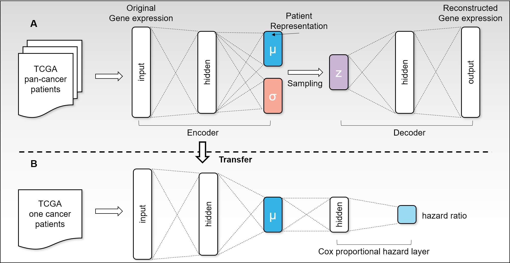

# Reproducing VAECox

A reproducibility study of **"Improved survival analysis by learning shared
genomic information from pan-cancer data"** (Kim, Kim, Choe, Lee & Kang,
*Bioinformatics* 36(Suppl_1):i389–i398, 2020),
[doi:10.1093/bioinformatics/btaa462](https://doi.org/10.1093/bioinformatics/btaa462) ·
original code: [dmis-lab/VAECox](https://github.com/dmis-lab/VAECox).



VAECox pretrains a variational autoencoder on pan-cancer RNA-seq, transfers the
encoder into a Cox proportional-hazards network, and fine-tunes it per cancer
type. The paper reports that this beats CoxLasso, CoxRidge and Cox-nnet on
**7 of 10** TCGA cancers by concordance index.

We retrain the whole pipeline on real TCGA data, test that claim, and extend the
study toward **responsible, low-resource medical AI**: robustness to missing and
noisy expression values, fairness across cancer cohorts and clinical subgroups,
lightweight models with an explicit equity check, and permutation-based gene
attribution.

## Layout

```
VAECox_reproduction.ipynb   the study — runs end to end on Kaggle (GPU)
RUN.md                      how to run it, step by step
REPRODUCIBILITY.md          reproducibility checklist (data, seeds, deviations)
paper/                      manuscript + build_manuscript.py (injects the numbers)
scripts/                    toy-data pipeline + the upstream fork (see its README)
data/                       toy expression pickles, 30 patients x 20 cancers
results/                    toy-data output (superseded by the real run)
docs/                       figures used by these documents
```

## Two tracks, and which one counts

| | Data | Purpose |
|---|---|---|
| **`VAECox_reproduction.ipynb`** | Real TCGA, open-access UCSC Xena mirror | **The study.** Phases 2–4 |
| `scripts/` | Toy data, 30 patients/cancer | Pipeline verification only |

The toy track cannot test the paper's claim — several cohorts have as few as 3
uncensored events, so the C-index there is dominated by split noise. Its numbers
are in `results/` and clearly labelled as such. Everything reported as a
reproduction result comes from the notebook.

## Quick start

```bash
# 1. Kaggle: attach the GenoTEX dataset, GPU T4 x2, Save & Run All  (~3.5-5 h)
# 2. Download vaecox_results.zip from the notebook output
unzip vaecox_results.zip -d out/
python paper/build_manuscript.py        # → paper/manuscript_filled.md
```

Full instructions, including how to split the run across sessions if you are
short on GPU quota, are in [RUN.md](RUN.md).

## Requirements

```bash
pip install numpy pandas scipy scikit-learn matplotlib seaborn lifelines torch tqdm
```

The notebook installs `lifelines` itself on Kaggle; everything else is in the
base image. The toy pipeline runs on CPU.

## Citation

Sunkyu Kim, Keonwoo Kim, Junseok Choe, Inggeol Lee, Jaewoo Kang.
*Improved survival analysis by learning shared genomic information from
pan-cancer data.* Bioinformatics 36(Supplement_1):i389–i398, July 2020.
